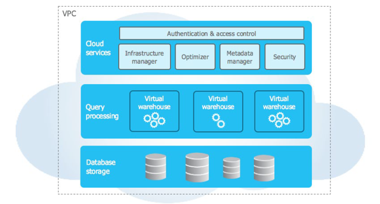
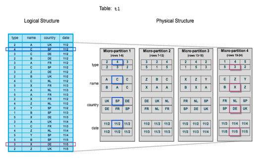
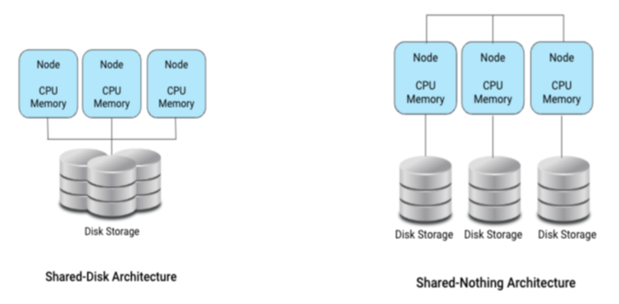
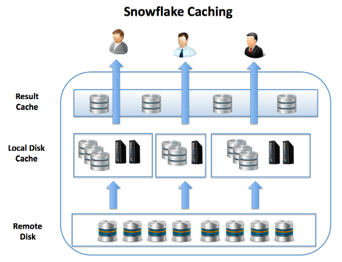
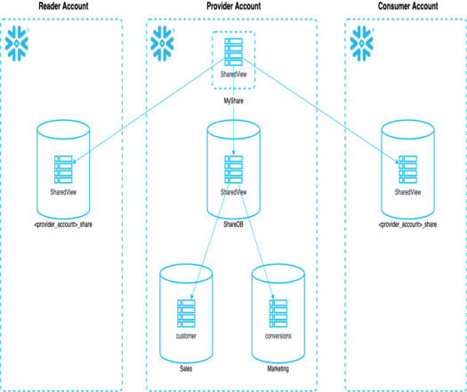

## Introducción y Arquitectura de Snowflake

## Tabla de Contenidos

- [Introducción y Arquitectura de Snowflake](#introducción-y-arquitectura-de-snowflake)
- [Tabla de Contenidos](#tabla-de-contenidos)
- [Conceptos básicos e introducción](#conceptos-básicos-e-introducción)
  - [¿Que es Snowflake?](#que-es-snowflake)
  - [¿Para qué se utiliza Snowflake?](#para-qué-se-utiliza-snowflake)
  - [Características principales](#características-principales)
  - [Caso práctico: Creación de una cuenta en Snowflake](#caso-práctico-creación-de-una-cuenta-en-snowflake)
    - [Objetivos del caso práctico](#objetivos-del-caso-práctico)
- [Arquitectura de Snowflake](#arquitectura-de-snowflake)
  - [Arquitectura de tres capas](#arquitectura-de-tres-capas)
    - [1. Service Layer (Cloud Services)](#1-service-layer-cloud-services)
    - [2. Compute Layer (Query Processing)](#2-compute-layer-query-processing)
    - [3. Storage Layer (Database Storage)](#3-storage-layer-database-storage)
- [Comparación entre bases de datos por filas y por columnas](#comparación-entre-bases-de-datos-por-filas-y-por-columnas)
  - [Arquitectura Multi-Cluster, Shared-Disk](#arquitectura-multi-cluster-shared-disk)
    - [Modelo de almacenamiento centralizado](#modelo-de-almacenamiento-centralizado)
    - [Procesamiento distribuido mediante Virtual Warehouses](#procesamiento-distribuido-mediante-virtual-warehouses)
    - [Escalabilidad y concurrencia optimizadas](#escalabilidad-y-concurrencia-optimizadas)
- [Conexión a Snowflake](#conexión-a-snowflake)
  - [Ecosistema de Snowflake](#ecosistema-de-snowflake)
  - [Snowsight: The Snowflake web interface](#snowsight-the-snowflake-web-interface)
  - [SnowSQL (CLI Client)](#snowsql-cli-client)
- [Caso práctico: Uso de SnowSQL para la gestión de datos](#caso-práctico-uso-de-snowsql-para-la-gestión-de-datos)
  - [Objetivos del caso práctico](#objetivos-del-caso-práctico-1)
  - [Snowflake Extension for Visual Studio Code](#snowflake-extension-for-visual-studio-code)
    - [Caso práctico: Conexión de Snowflake con VSC](#caso-práctico-conexión-de-snowflake-con-vsc)
- [Virtual Warehouse](#virtual-warehouse)
  - [Funciones del Warehouse](#funciones-del-warehouse)
  - [Sintaxis para la gestión de un Warehouse](#sintaxis-para-la-gestión-de-un-warehouse)
    - [Creación de un Warehouse](#creación-de-un-warehouse)
    - [Ejemplo de configuración avanzada](#ejemplo-de-configuración-avanzada)
    - [Modificación y gestión de un Warehouse](#modificación-y-gestión-de-un-warehouse)
    - [Eliminación de un Warehouse](#eliminación-de-un-warehouse)
  - [Tipos de Virtual Warehouse](#tipos-de-virtual-warehouse)
    - [Ejemplo: Crear un warehouse optimizado para Snowpark](#ejemplo-crear-un-warehouse-optimizado-para-snowpark)
  - [Warehouse Size](#warehouse-size)
    - [Configuración de AUTO_SUSPEND](#configuración-de-auto_suspend)
    - [Configuración de AUTO_RESUME](#configuración-de-auto_resume)
  - [Escalabilidad Automática con Multi-cluster](#escalabilidad-automática-con-multi-cluster)
    - [¿Cómo funciona?](#cómo-funciona)
    - [Ejemplo de creación de un Warehouse con escalabilidad automática:](#ejemplo-de-creación-de-un-warehouse-con-escalabilidad-automática)
    - [Política de Escalado](#política-de-escalado)
  - [Impacto del Tamaño del Warehouse y Recomendaciones por Tipo de Carga](#impacto-del-tamaño-del-warehouse-y-recomendaciones-por-tipo-de-carga)
    - [Cargas de datos (ETL)](#cargas-de-datos-etl)
    - [Consultas y dashboards (BI)](#consultas-y-dashboards-bi)
    - [Desarrollo y pruebas](#desarrollo-y-pruebas)
    - [Ciencia de datos / Snowpark](#ciencia-de-datos--snowpark)
  - [Caché en el Warehouse](#caché-en-el-warehouse)
  - [Caso práctico: Creación de Warehouses según necesidades de cada rol](#caso-práctico-creación-de-warehouses-según-necesidades-de-cada-rol)
    - [Objetivos del caso práctico](#objetivos-del-caso-práctico-2)
- [Zero-Copy Cloning y Data Sharing en Snowflake](#zero-copy-cloning-y-data-sharing-en-snowflake)
  - [¿Qué es Zero-Copy Cloning?](#qué-es-zero-copy-cloning)
    - [Ventajas](#ventajas)
    - [Sintaxis para crear un clon:](#sintaxis-para-crear-un-clon)
- [Data Sharing en Snowflake](#data-sharing-en-snowflake)
  - [¿Qué es Data Sharing?](#qué-es-data-sharing)
  - [Arquitectura del Data Sharing](#arquitectura-del-data-sharing)
  - [Métodos de Compartición de Datos](#métodos-de-compartición-de-datos)
  - [Pasos para crear un Data Share](#pasos-para-crear-un-data-share)
  - [Uso de Reader Accounts](#uso-de-reader-accounts)
    - [¿Qué es un Reader Account?](#qué-es-un-reader-account)
    - [Crear una cuenta Reader:](#crear-una-cuenta-reader)
  - [Acceso a los datos compartidos desde la cuenta consumidora](#acceso-a-los-datos-compartidos-desde-la-cuenta-consumidora)
  - [Beneficios del Data Sharing](#beneficios-del-data-sharing)
  - [Caso práctico: Creación y uso de Shares en Snowflake](#caso-práctico-creación-y-uso-de-shares-en-snowflake)
    - [Objetivos del caso práctico](#objetivos-del-caso-práctico-3)
- [Time Travel](#time-travel)
  - [¿Qué es Time Travel?](#qué-es-time-travel)
    - [Comandos para recuperar datos:](#comandos-para-recuperar-datos)
    - [Clonado con Time Travel](#clonado-con-time-travel)
- [Fail-safe en Snowflake](#fail-safe-en-snowflake)
  - [¿Qué es Fail-safe?](#qué-es-fail-safe)
  - [Diferencias entre Time Travel y Fail-safe](#diferencias-entre-time-travel-y-fail-safe)
- [Snowflake Caching](#snowflake-caching)
  - [1. Query Result Cache](#1-query-result-cache)
  - [2. Metadata Cache](#2-metadata-cache)
  - [3. Virtual Warehouse Local Disk Cache](#3-virtual-warehouse-local-disk-cache)


---

## Conceptos básicos e introducción

### ¿Que es Snowflake?

Snowflake es una plataforma en la nube diseñada para el almacenamiento y análisis de datos. Es una solución:  
- **Escalable**  
- **Segura**  
- **Eficiente**  

A diferencia de bases de datos convencionales, Snowflake es un servicio totalmente administrado, permitiendo a las organizaciones enfocarse en el análisis en lugar de la administración de infraestructura.

### ¿Para qué se utiliza Snowflake?
Snowflake es ampliamente utilizado en diversos sectores para satisfacer necesidades de almacenamiento y análisis de datos.

- **Data Warehousing**  
- **Business Intelligence (BI) y Analítica**  
- **Integración de Datos (ETL/ELT)**  
- **Machine Learning e Inteligencia Artificial**  
- **Big Data y procesamiento en tiempo real**  
- **Gobernanza y seguridad de datos**  

### Características principales
Snowflake ofrece una serie de características clave que lo diferencian de otras soluciones de almacenamiento y análisis de datos

- **Arquitectura de almacenamiento y computación separada**  
- **Almacenamiento en la nube**  
- **Escalabilidad automática**  
- **Soporte para datos estructurados y semiestructurados**  
- **Concurrencia y aislamiento de cargas de trabajo**  
- **Modelo de pago por uso**  

### Caso práctico: Creación de una cuenta en Snowflake  

Como primer caso práctico del curso, crearemos una cuenta en Snowflake desde cero. Este ejercicio permitirá familiarizarse con la plataforma y explorar sus capacidades desde el primer acceso.  

#### Objetivos del caso práctico  
- Aprender a registrarse en **Snowflake** de forma gratuita.  
- Configurar los primeros ajustes de la cuenta.  
- Acceder a la interfaz web **Snowsight** y conocer sus funcionalidades básicas.  

Para comenzar, sigue las instrucciones detalladas en el siguiente documento:  

📄 **[Caso Práctico: Creación de Cuenta en Snowflake](01_creacion_cuenta_snowflake.md)**  

✅ **Al completar este caso práctico, estarás listo para explorar Snowflake y empezar a trabajar con datos en la nube.**  

---

## Arquitectura de Snowflake

### Arquitectura de tres capas



*Figura: Diagrama de la arquitectura de tres capas en Snowflake, que incluye Cloud Services, Query Processing y Database Storage.*

#### 1. Service Layer (Cloud Services)
Esta capa es la encargada de **gestionar la seguridad, autenticación y control de acceso en Snowflake**. Incluye funciones como la optimización de consultas, el manejo de metadatos y la integración con herramientas externas de Business Intelligence (BI) y procesos de extracción, transformación y carga (ETL). Además, administra la infraestructura subyacente de la plataforma en la nube, permitiendo que Snowflake se ofrezca como un servicio completamente gestionado.

#### 2. Compute Layer (Query Processing)  
El procesamiento de consultas en Snowflake se realiza a través de los **Virtual Warehouses**. Estas instancias de cómputo operan de manera independiente, lo que permite ejecutar múltiples cargas de trabajo simultáneamente sin interferencias. Snowflake permite escalar los warehouses de forma automática tanto horizontal como verticalmente, asegurando un rendimiento óptimo según la demanda. Esta independencia evita problemas de concurrencia y permite una ejecución eficiente de consultas sobre grandes volúmenes de datos.

#### 3. Storage Layer (Database Storage)  
La capa de almacenamiento en Snowflake está diseñada para ser altamente escalable y segura. Utiliza un modelo de almacenamiento en formato columnar optimizado, lo que mejora la compresión y la eficiencia en la consulta de datos. Los datos almacenados en Snowflake están distribuidos automáticamente en múltiples regiones de la nube y pueden residir en proveedores como AWS, Azure o Google Cloud Platform. Además, Snowflake implementa **técnicas avanzadas de compresión** y **cifrado automático**, garantizando la seguridad y el rendimiento de los datos almacenados.  

Un aspecto clave de esta capa es la capacidad de **pruning inteligente**, que permite minimizar la cantidad de datos escaneados en consultas, optimizando el rendimiento sin necesidad de intervención manual.



*Figura: Ejemplo de pruning inteligente en Snowflake, donde se minimiza la cantidad de datos escaneados al optimizar el acceso a micro-particiones.*

## Comparación entre bases de datos por filas y por columnas  

Las bases de datos pueden organizar su información de diferentes maneras según su propósito. En esta tabla se comparan las bases de datos orientadas a filas y a columnas en función de su estructura, recuperación de datos, tipos de operación y ejemplos de cada una.  

- **Bases de datos por filas**: Optimizadas para transacciones rápidas, donde los registros completos suelen recuperarse con frecuencia. Son ideales para sistemas **OLTP** (Procesamiento de Transacciones en Línea).  
  - **Ejemplos**: *Postgres*, MySQL, Oracle, SQL Server.  

- **Bases de datos por columnas**: Diseñadas para análisis de grandes volúmenes de datos, ya que permiten escanear solo las columnas necesarias en lugar de registros completos. Son ideales para entornos **OLAP** (Procesamiento Analítico en Línea).  
  - **Ejemplos**: Snowflake, Amazon *Redshift*, *BigQuery*.  

Este modelo de almacenamiento impacta directamente en el rendimiento y eficiencia de las consultas dependiendo del tipo de carga de trabajo que se maneje.


| Categoría              | Filas                          | Columnas                          |
|------------------------|------------------------------|-----------------------------------|
| Organización de datos  | Por filas                     | Por columnas                     |
| Recuperación de datos  | Registros completos          | Columnas relevantes              |
| Tipos de operación     | Transaccionales              | Analíticas                       |
| Ejemplos               | *Postgres*, MySQL, Oracle, SQL Server | Snowflake, Amazon *Redshift*, *BigQuery* |


### Arquitectura Multi-Cluster, Shared-Disk

Snowflake implementa un modelo de arquitectura híbrido que combina elementos de **shared-disk** y **shared-nothing**. Esta combinación permite aprovechar lo mejor de ambos enfoques: la facilidad de administración del almacenamiento compartido y la eficiencia del procesamiento distribuido.

#### Modelo de almacenamiento centralizado  
A diferencia de las bases de datos tradicionales de procesamiento distribuido, Snowflake utiliza un **repositorio de almacenamiento centralizado** donde todos los nodos pueden acceder a los datos. Este enfoque elimina la necesidad de replicar datos entre nodos, lo que simplifica la gestión del almacenamiento y permite un acceso más eficiente a la información sin afectar el rendimiento.

#### Procesamiento distribuido mediante Virtual Warehouses  
El cómputo en Snowflake se lleva a cabo mediante **clústeres de warehouses virtuales**, donde cada nodo dentro del clúster procesa diferentes porciones de los datos de forma independiente. Gracias a este modelo, es posible ejecutar múltiples consultas en paralelo sin que unas interfieran con otras. Además, Snowflake permite escalar dinámicamente los warehouses, agregando más recursos cuando la demanda aumenta y reduciéndolos cuando no se necesitan.

#### Escalabilidad y concurrencia optimizadas  
Uno de los mayores beneficios de esta arquitectura es su capacidad de **escalar horizontalmente** de forma automática y sin interrupciones. Si un alto volumen de usuarios o consultas genera carga en el sistema, Snowflake puede desplegar nodos adicionales para equilibrar la carga y mejorar el tiempo de respuesta. Esta escalabilidad evita los bloqueos y problemas de concurrencia típicos de las bases de datos tradicionales.

Gracias a este enfoque híbrido, Snowflake logra combinar una administración sencilla con alto rendimiento y escalabilidad, adaptándose tanto a cargas de trabajo analíticas como a grandes volúmenes de procesamiento de datos en tiempo real.



*Figura: Comparación entre la arquitectura Shared-Disk y Shared-Nothing. En la arquitectura Shared-Disk, múltiples nodos comparten el mismo almacenamiento, mientras que en la arquitectura Shared-Nothing, cada nodo tiene su propio almacenamiento independiente, permitiendo un procesamiento distribuido más eficiente.*


## Conexión a Snowflake

### Ecosistema de Snowflake

A través de una red extensiva de conectores, drivers , lenguajes de programación, y utilidades, incluyendo:

- Partners certificados que proveen soluciones on-premise o en la nube para conectarse a Snowflake

- Otras herramientas y tecnologías tercerizadas que son conocidas para trabajar con Snowflake

- Clientes de Snowflake, incluyendo SnowSQL (_command line interface_), conectores para Python y Spark, y drivers para Node.js, JDBC, ODBC, y más.

>ℹ️ **Info**: Snowflake trabaja con una amplia variedad de herramientas y tecnologías lideres en la industria.


- Data Integration. ETL

- Business Intelligence

- Machine Learning and Data Science

- Security and Governance

- SQL Development and Management

- Native Programmatic Interfaces

- Snowflake Partner Connect

### Snowsight: The Snowflake web interface

Snowsight es el nombre de la interfaz gráfica en Snowflake y provee una experiencia unificada para trabajar con sus datos de Snowflake utilizando SQL o Python:

- Queries de SQL

- ML workflows utilizando notebooks de Snowflake

- Análisis de datos con Snowflake Copilot

- Snowpark Python

- Monitoreo de desempeño de queries e historia.

- Visualización

- Desarrollar y compartir Snowflake Native Apps

- Snowflake Marketplace

>ℹ️ **Info**: Snowflake resume el potente soporte SQL de Snowflake en una experiencia unificada y fácil de usar, importante para operaciones críticas de Snowflake.


Desde esta interfaz también podremos realizar operaciones y gestiones de administración de la plataforma:

- Administración de costos.

- Riesgos de seguridad, monitoreo y evaluación

- Monitoreo de la carga de datos

- Creación y administración de usuarios

- Creación y administración de roles.

- Etc, etc, etc.

### SnowSQL (CLI Client)

SnowSQL es una herramienta poderosa y flexible para interactuar con Snowflake, proporcionando una interfaz de línea de comandos robusta para la ejecución de consultas, administración de bases de datos y manipulación de datos, todo ello con un enfoque en la seguridad y la eficiencia.

Permite a los usuarios ejecutar consultas SQL, scripts y comandos de administración directamente desde su terminal o línea de comandos.

Está diseñado para interactuar con el entorno de Snowflake, facilitando tareas como la ejecución de consultas, la carga y descarga de datos, y la administración de bases de datos y objetos de almacenamiento.

>ℹ️ **Info**: SnowSQL es el cliente de línea de comandos para conectarse a Snowflake y ejecutar consultas SQL y realizar todas las operaciones DDL y DML, incluida la carga y descarga de datos de las tablas de la base de datos.

## Caso práctico: Uso de SnowSQL para la gestión de datos

En este caso práctico, exploraremos SnowSQL, la interfaz de línea de comandos (CLI) de Snowflake, y aprenderemos a utilizarlo para ejecutar consultas y administrar datos en Snowflake.

### Objetivos del caso práctico  
- Instalar y configurar **SnowSQL** en tu equipo.  
- Conectarse a una cuenta de **Snowflake** mediante SnowSQL.  
- Ejecutar consultas SQL para la gestión de datos.  
- Cargar y descargar datos en Snowflake desde la línea de comandos.  

Para comenzar, sigue las instrucciones detalladas en el siguiente documento:  

📄 **[Caso Práctico: Uso de SnowSQL](01_snowsql.md)**  

✅ **Al completar este caso práctico, serás capaz de manejar Snowflake desde la línea de comandos.**


### Snowflake Extension for Visual Studio Code

Snowflake proporciona una extensión para Visual Studio Code (VS Code) que permite a los usuarios de Snowflake escribir y ejecutar sentencias SQL de Snowflake directamente en VS Code. La extensión también se integra con Snowpark Python para proporcionar funciones de depuración, resaltado de sintaxis y autocompletado para SQL en código Python.

Las extensiones son funcionalidades preempaquetadas, a menudo proporcionadas por terceros, que añaden nuevas características y funcionalidades a VS Code.

>ℹ️ **Info**: Utilice la extensión Snowflake para Visual Studio Code para conectarse a Snowflake dentro de Visual Studio Code y realizar operaciones SQL.

#### Caso práctico: Conexión de Snowflake con VSC

Este caso práctico te guiará en la instalación y configuración de la extensión de Snowflake en Visual Studio Code, permitiéndote conectarte a tu cuenta de Snowflake y ejecutar consultas SQL directamente desde el editor

📄 **[Caso práctico: Conexión de Snowflake con VSC](01_conexion_vs.md)**

---

## Virtual Warehouse

Un **Virtual Warehouse**, o simplemente **warehouse**, es un clúster de recursos informáticos que proporciona Snowflake para ejecutar operaciones como consultas, cargas de datos y transformaciones. Es un componente fundamental del modelo de computación escalable de Snowflake.

### Funciones del Warehouse

Un warehouse proporciona recursos como CPU, memoria y almacenamiento temporal para realizar las siguientes operaciones:

- **Consultas SQL** (`SELECT`) que requieren procesamiento.
- **Operaciones DML**:
  - Inserciones, actualizaciones o eliminaciones de datos (`INSERT`, `UPDATE`, `DELETE`).
  - Carga de datos (`COPY INTO <tabla>`).
  - Exportación de datos (`COPY INTO <ubicación>`).

Para que estas operaciones se ejecuten, el warehouse debe estar en ejecución y vinculado a la sesión activa.

### Sintaxis para la gestión de un Warehouse
#### Creación de un Warehouse

La sintaxis básica para crear un Virtual Warehouse en Snowflake y definir su tamaño es la siguiente:

```sql
CREATE WAREHOUSE WH_DEMO
WITH WAREHOUSE_SIZE = 'MEDIUM';
```

En este ejemplo, se crea un warehouse llamado `WH_DEMO` con un tamaño de `MEDIUM`. Puedes ajustar el tamaño según las necesidades de tu carga de trabajo seleccionando entre los tamaños disponibles como `X-Small`, `Small`, `Large`, etc.

Además, es posible configurar **parámetros adicionales** para automatizar su uso, como la suspensión automática por inactividad o la reanudación automática al recibir una consulta. 
En la siguiente tabla, se presenta una lista más detallada con algunos de los parámetros de configuración principales:

| Parámetro                              | Descripción                                                                                     | Valores posibles                          | Valor por defecto |
|----------------------------------------|-------------------------------------------------------------------------------------------------|-------------------------------------------|-------------------|
| `WAREHOUSE_TYPE`                       | Especifica el tipo de warehouse.                                                                | `STANDARD`, `SNOWPARK-OPTIMIZED`          | `STANDARD`        |
| `WAREHOUSE_SIZE`                       | Define el tamaño del warehouse, que determina la cantidad de recursos computacionales asignados.| `X-Small`, `Small`, `Medium`, `Large`, etc.| `Small`           |
| `AUTO_SUSPEND`                         | Tiempo (en segundos) de inactividad tras el cual el warehouse se suspende automáticamente.      | Número entero (en segundos) o `NULL`      | 600 (10 minutos)  |
| `AUTO_RESUME`                          | Habilita o deshabilita la reactivación automática del warehouse al recibir una consulta.        | `TRUE`, `FALSE`                           | `TRUE`            |
| `INITIALLY_SUSPENDED`                  | Indica si el warehouse debe crearse en estado suspendido.                                       | `TRUE`, `FALSE`                           | `FALSE`           |
| `MIN_CLUSTER_COUNT`                    | Número mínimo de clústeres activos en un warehouse multi-cluster.                               | Número entero                             | 1                 |
| `MAX_CLUSTER_COUNT`                    | Número máximo de clústeres que el warehouse puede escalar automáticamente.                      | Número entero                             | 1                 |
| `SCALING_POLICY`                       | Define la política de escalado para warehouses multi-cluster.                                   | `STANDARD`, `ECONOMY`                     | `STANDARD`        |
| `ENABLE_QUERY_ACCELERATION`           | Activa o desactiva la aceleración de consultas para mejorar el rendimiento.                     | `TRUE`, `FALSE`                           | `FALSE`           |
| `STATEMENT_QUEUED_TIMEOUT_IN_SECONDS` | Tiempo máximo que una consulta puede permanecer en cola antes de ser cancelada.                 | Número entero (en segundos)               | 0 (sin límite)    |
| `STATEMENT_TIMEOUT_IN_SECONDS`        | Tiempo máximo permitido para la ejecución de una consulta antes de ser cancelada.               | Número entero (en segundos)               | 0 (sin límite)    |
| `RESOURCE_MONITOR`                     | Asocia un monitor de recursos para controlar el consumo de créditos del warehouse.              | Nombre de un monitor de recursos          | `NULL`            |


#### Ejemplo de configuración avanzada

A continuación, se muestra un ejemplo de cómo configurar un warehouse con varios de estos parámetros:

```sql
CREATE WAREHOUSE WH_ADVANCED
WITH WAREHOUSE_SIZE = 'LARGE'
  AUTO_SUSPEND = 300
  AUTO_RESUME = TRUE
  MIN_CLUSTER_COUNT = 2
  MAX_CLUSTER_COUNT = 5
  SCALING_POLICY = 'ECONOMY'
  STATEMENT_TIMEOUT_IN_SECONDS = 3600
  RESOURCE_MONITOR = 'MONITOR_WH';
```

En este ejemplo:
- Se crea un warehouse de tamaño `LARGE`.
- Se suspende automáticamente tras 5 minutos de inactividad (`AUTO_SUSPEND = 300`).
- Se reactiva automáticamente al recibir una consulta (`AUTO_RESUME = TRUE`).
- Puede escalar entre 2 y 5 clústeres según la carga concurrente.
- Utiliza la política de escalado `ECONOMY` para priorizar el ahorro de costos.
- Las consultas tienen un tiempo máximo de ejecución de 1 hora (`STATEMENT_TIMEOUT_IN_SECONDS = 3600`).
- Se asocia un monitor de recursos llamado `MONITOR_WH` para controlar el consumo de créditos.

> ℹ️ **Nota**: Configurar estos parámetros adecuadamente puede optimizar el rendimiento y los costos de los warehouses en Snowflake, adaptándolos a las necesidades específicas de cada entorno.

#### Modificación y gestión de un Warehouse

Una vez creado, puedes modificar las propiedades de un warehouse usando el comando `ALTER WAREHOUSE`. Algunos ejemplos comunes:

```sql
ALTER WAREHOUSE WH_ENGINEERING SET WAREHOUSE_SIZE = 'MEDIUM';
```

Este comando cambia el tamaño del warehouse `WH_ENGINEERING` a `MEDIUM`.

```sql
ALTER WAREHOUSE WH_DATASCIENCE SET AUTO_SUSPEND = 120;
```

Este comando configura el warehouse `WH_DATASCIENCE` para que se suspenda automáticamente tras 120 segundos de inactividad.

```sql
ALTER WAREHOUSE WH_ANALYTICS SUSPEND;
```

Este comando suspende manualmente el warehouse `WH_ANALYTICS`, liberando los recursos computacionales.

```sql
ALTER WAREHOUSE WH_ANALYTICS RESUME;
```

Este comando inicia manualmente el warehouse `WH_ANALYTICS`.

```sql
SELECT CURRENT_WAREHOUSE();
```

Con este comando SQL se obtiene la información del warehouse iniciado y en uso.

#### Eliminación de un Warehouse

Para eliminar un Virtual Warehouse que ya no necesitas, puedes usar el siguiente comando:

```sql
DROP WAREHOUSE WH_DEMO;
```

Este comando elimina el warehouse `WH_DEMO` permanentemente. Asegúrate de que el warehouse no esté en uso antes de ejecutarlo.


### Tipos de Virtual Warehouse

Snowflake permite crear warehouses adaptados al tipo de carga de trabajo mediante el parámetro `WAREHOUSE_TYPE`. Existen dos tipos principales:

- **STANDARD** (por defecto): Adecuado para la mayoría de cargas de trabajo, como consultas SQL, cargas de datos, operaciones DML, etc.
- **SNOWPARK-OPTIMIZED**: Diseñado para ejecutar código en **Snowpark**, ofreciendo recursos adicionales ideales para flujos de trabajo avanzados de **machine learning**, procesamiento distribuido y ejecución de código en Python o Java dentro de Snowflake.

#### Ejemplo: Crear un warehouse optimizado para Snowpark

```sql
CREATE WAREHOUSE WH_SPARK
WITH WAREHOUSE_SIZE = 'MEDIUM'
     WAREHOUSE_TYPE = 'SNOWPARK-OPTIMIZED'
```

> ℹ️ Utiliza `SNOWPARK-OPTIMIZED` si vas a trabajar con Snowpark, notebooks o flujos de ciencia de datos directamente en Snowflake.


### Warehouse Size


El tamaño de un warehouse determina la cantidad de recursos computacionales disponibles. Snowflake admite los siguientes tamaños:

| Warehouse Size | Credits / Hour | Credits / Second | Notes |
| -------------- | -------------- | ---------------- | ----- |
| X-Small        | 1              | 0.0003           | Tamaño por defecto en Snowsight |
| Small          | 2              | 0.0006           | |
| Medium         | 4              | 0.0011           | |
| Large          | 8              | 0.0022           | |
| X-Large        | 16             | 0.0044           | Creado en Classic Console |
| 2X-Large       | 32             | 0.0089           | |
| 3X-Large       | 64             | 0.0178           | |
| 4X-Large       | 128            | 0.0356           | |
| 5X-Large       | 256            | 0.0711           | Disponible en AWS y Azure |
| 6X-Large       | 512            | 0.1422           | Disponible en AWS y Azure |

El consumo de créditos se multiplica a medida que aumenta el tamaño del warehouse. Snowflake factura por segundos con un mínimo de 60 segundos por inicio.

| Running Time | Credits (X-Small) | Credits (X-Large) | Credits (5X-Large) |
| ------------ | ----------------- | ----------------- | ------------------ |
| 0-60 seconds | 0.017             | 0.267             | 4.268              |
| 61 seconds   | 0.017             | 0.271             | 4.336              |
| 2 minutes    | 0.033             | 0.533             | 8.532              |
| 10 minutes   | 0.167             | 2.667             | 42.668             |
| 1 hour       | 1.000             | 16.000            | 256.000            |


#### Configuración de AUTO_SUSPEND

`AUTO_SUSPEND` define el tiempo (en segundos) que debe pasar sin actividad para que el warehouse se suspenda automáticamente. Esto ayuda a ahorrar créditos cuando no se está utilizando.

```sql
CREATE WAREHOUSE WH_DEMO
WITH WAREHOUSE_SIZE = 'MEDIUM'
     AUTO_SUSPEND = 300; -- Suspender tras 5 minutos de inactividad
```

#### Configuración de AUTO_RESUME

`AUTO_RESUME` permite que el warehouse se reactive automáticamente al recibir una consulta, sin necesidad de intervención manual.

```sql
CREATE WAREHOUSE WH_DEMO
WITH WAREHOUSE_SIZE = 'MEDIUM'
     AUTO_RESUME = TRUE;
```

También se pueden combinar ambas configuraciones junto con el tamaño:

```sql
CREATE WAREHOUSE WH_DEMO
WITH WAREHOUSE_SIZE = 'MEDIUM'
     AUTO_SUSPEND = 300
     AUTO_RESUME = TRUE;
```

> ℹ️ Mientras un WH esté activo, consume **créditos Snowflake**, lo que hace importante optimizar su configuración.

> ℹ️ Consejo: Habilita `AUTO_SUSPEND` y `AUTO_RESUME` para evitar costos innecesarios por warehouses activos sin uso.


### Escalabilidad Automática con Multi-cluster

En Snowflake, un **Multi-cluster Warehouse** permite escalar automáticamente horizontalmente (añadiendo más clústeres de cómputo) para responder a picos de carga y mejorar la **concurrencia** sin degradar el rendimiento.

Esto es especialmente útil cuando múltiples usuarios o procesos están ejecutando consultas al mismo tiempo, como sucede en entornos de BI o dashboards interactivos.

#### ¿Cómo funciona?

Cuando un warehouse está configurado como **multi-cluster**, Snowflake puede iniciar automáticamente **uno o más clústeres adicionales** para repartir la carga cuando hay muchas consultas simultáneas encoladas.

Puedes definir:
- `MIN_CLUSTER_COUNT`: número mínimo de clústeres activos.
- `MAX_CLUSTER_COUNT`: número máximo de clústeres que Snowflake puede iniciar automáticamente según la demanda.

#### Ejemplo de creación de un Warehouse con escalabilidad automática:

```sql
CREATE WAREHOUSE WH_DEMO
WITH WAREHOUSE_SIZE = 'MEDIUM'
     MIN_CLUSTER_COUNT = 1
     MAX_CLUSTER_COUNT = 3
     AUTO_SUSPEND = 300
     AUTO_RESUME = TRUE;
```

> 🔁 En este ejemplo, Snowflake comenzará con 1 clúster y podrá escalar hasta 3 si detecta carga concurrente elevada.

---

#### Política de Escalado

Además del rango de clústeres, puedes definir **cómo** Snowflake decide cuándo escalar mediante el parámetro `SCALING_POLICY`:

- **STANDARD**:  
  - Escala rápidamente al detectar alta carga (cuando un clúster está al 100%).  
  - Prioriza el **rendimiento**.  
  - Puede generar un **mayor consumo de créditos**.

- **ECONOMY**:  
  - Escala más lentamente o con mayor tolerancia a la carga.  
  - Prioriza el **ahorro de costos**.  
  - Puede generar **colas si la carga es alta**.

```sql
CREATE WAREHOUSE WH_DEMO
WITH SCALING_POLICY = 'ECONOMY';
```

> ℹ️ Usa `STANDARD` para entornos críticos donde el tiempo de respuesta es prioritario, y `ECONOMY` en entornos donde el ahorro de costes es más importante que la velocidad.


### Impacto del Tamaño del Warehouse y Recomendaciones por Tipo de Carga

El tamaño del warehouse influye directamente en el rendimiento de las operaciones, pero **no siempre más grande significa mejor**. La elección debe basarse en el tipo de carga de trabajo:

#### Cargas de datos (ETL)
- **Tamaño recomendado**: `Small` o `Medium`
- El rendimiento depende más del número y tamaño de archivos que del tamaño del warehouse
- Aumentar el tamaño puede **no mejorar la velocidad**, pero sí el coste

#### Consultas y dashboards (BI)
- **Tamaño recomendado**: `Medium` o `Large`
- Para consultas simultáneas o dashboards activos, se recomienda usar **multi-cluster** con escalabilidad automática
- **Consultas complejas** pueden beneficiarse de mayor tamaño, pero **consultas simples** no necesariamente

#### Desarrollo y pruebas
- **Tamaño recomendado**: `X-Small` o `Small`
- Ideal para cargas ligeras y entornos de bajo consumo
- Activar `AUTO_SUSPEND` y `AUTO_RESUME` para minimizar el gasto de créditos

#### Ciencia de datos / Snowpark
- **Tamaño recomendado**: `Large` o superior
- Utilizar `WAREHOUSE_TYPE = 'SNOWPARK-OPTIMIZED'` para procesamiento con Python o Java
- Adecuado para tareas con alto uso de CPU y memoria


### Caché en el Warehouse

Snowflake utiliza mecanismos de caché para mejorar el rendimiento de las consultas. Mientras un warehouse está activo, **almacena en memoria los resultados y datos más utilizados**, lo que reduce el acceso a disco y acelera la ejecución de consultas repetidas.



Sin embargo, hay que tener en cuenta que:

- La caché **se borra** cuando el warehouse se suspende o se ejecuta una operación DML (`INSERT`, `UPDATE`, `DELETE`, etc.).
- Activar `AUTO_SUSPEND` con tiempos muy bajos puede impedir que se aproveche la caché de manera efectiva.

> ⚠️ **Recomendación**: Ajusta los tiempos de suspensión automática para **equilibrar el ahorro de créditos y el aprovechamiento de la caché**, especialmente en entornos donde se repiten muchas consultas.

### Caso práctico: Creación de Warehouses según necesidades de cada rol

En este caso práctico, exploraremos SnowSQL, la interfaz de línea de comandos (CLI) de Snowflake, y aprenderemos a utilizarlo para ejecutar consultas y administrar datos en Snowflake.

#### Objetivos del caso práctico  
- Crear diferentes warehouses para distintos roles en la empresa.
- Configurar parámetros adecuados para cada tipo de workload.
- Optimizar el rendimiento y el consumo de créditos en Snowflake.
- Consolidar conocimientos aprendidos.

Para comenzar, sigue las instrucciones detalladas en el siguiente documento:  

📄 **[Caso Práctico: Creación de Warehouses según necesidades de cada rol](01_creacion_warehouses.md)**  

✅ **Al completar este caso práctico, serás capaz de crear, modificar y gestionar warehouses en Snowflake.**


---

## Zero-Copy Cloning y Data Sharing en Snowflake

### ¿Qué es Zero-Copy Cloning?

**Zero-Copy Cloning** permite crear una copia de bases de datos, esquemas o tablas sin duplicar físicamente los datos. Las copias son instantáneas y no consumen espacio adicional, ya que se referencian los mismos datos hasta que hay cambios (copy-on-write).

#### Ventajas
- Clonado instantáneo de grandes volúmenes de datos.
- Ideal para entornos de desarrollo, testing o validaciones.
- No incrementa el coste de almacenamiento inmediatamente.
- Compatible con Time Travel.

#### Sintaxis para crear un clon:

```sql
CREATE OR REPLACE TABLE mi_tabla_clon CLONE mi_tabla_original;
CREATE OR REPLACE SCHEMA mi_esquema_clon CLONE mi_esquema;
CREATE OR REPLACE DATABASE mi_db_clon CLONE mi_db;
```


<p>


<hr style="border: none; border-top: 1.5px dashed #000; background-color: transparent;">

## Data Sharing en Snowflake

### ¿Qué es Data Sharing?

Snowflake permite **compartir datos entre cuentas** sin necesidad de moverlos ni copiarlos. Esta funcionalidad se conoce como **Data Sharing**, y garantiza acceso a datos en **tiempo real**, de forma **segura** y **eficiente**, sin duplicación de almacenamiento.

> **Ventajas clave**:
- Acceso instantáneo a los datos compartidos
- No se generan copias adicionales de los datos
- Acceso de solo lectura para garantizar la integridad
- Alta seguridad con permisos granulares
- Compatible con múltiples cuentas o partners


### Arquitectura del Data Sharing

- Un **proveedor** crea un `SHARE` y otorga acceso a bases de datos o tablas.
- Una **cuenta consumidora** accede a estos datos directamente, sin copiarlos.
- Las consultas se ejecutan en tiempo real desde la cuenta consumidora.

```text
Proveedor → [SHARE] → Cuenta consumidora (misma región o con Snowgrid)
```

<hr style="border: none; border-top: 1.5px dashed #000; background-color: transparent;">


### Métodos de Compartición de Datos

| Método                    | Descripción                                                                 |
|---------------------------|-----------------------------------------------------------------------------|
| **Direct Data Sharing**   | Compartición entre cuentas Snowflake en la misma región.                   |
| **Reader Accounts**       | Permite compartir datos con organizaciones **sin cuenta Snowflake**.       |
| **Snowflake Marketplace** | Plataforma para publicar y consumir datasets compartidos públicamente.     |
| **Cross-Cloud Sharing**   | Compartición entre regiones o nubes distintas mediante **Snowgrid**.       |

*Tabla con la comparación de métodos de compartición de datos*


*Métodos de comparticion de datos en Snowflake*

> ℹ️ **Snowgrid** es la tecnología subyacente de Snowflake que permite la colaboración y el intercambio de datos entre cuentas en diferentes regiones y nubes. Facilita el **Cross-Cloud Sharing**, asegurando que los datos se compartan de manera segura, eficiente y en tiempo real, independientemente de la ubicación geográfica o el proveedor de nube utilizado.

<hr style="border: none; border-top: 1.5px dashed #000; background-color: transparent;">

### Pasos para crear un Data Share

1. Crear el SHARE:

```sql
CREATE SHARE ventas_share;
```

2. Agregar una base de datos o tablas al SHARE:

```sql
GRANT USAGE ON DATABASE ventas_db TO SHARE ventas_share;
GRANT SELECT ON ALL TABLES IN SCHEMA ventas_db.public TO SHARE ventas_share;
```

3. Agregar una cuenta consumidora (que ya tenga Snowflake):

```sql
ALTER SHARE ventas_share ADD ACCOUNT = 'ACCOUNT_ID_CONSUMIDOR';
```

<hr style="border: none; border-top: 1.5px dashed #000; background-color: transparent;">

### Uso de Reader Accounts

Cuando el consumidor **no tiene una cuenta de Snowflake**, se puede crear un **Reader Account**, gestionado por el proveedor, para que acceda con permisos de solo lectura.

#### ¿Qué es un Reader Account?

- Es una cuenta administrada por el proveedor de datos.
- No requiere que el cliente tenga una suscripción activa a Snowflake.
- Ideal para compartir datos con partners, clientes o equipos externos.

#### Crear una cuenta Reader:

```sql
CREATE MANAGED ACCOUNT cliente_analytics
ADMIN_NAME = 'admin_user'
ADMIN_PASSWORD = 'SecurePassword123'
TYPE = READER;
```

> ℹ️ Después de crear la cuenta, también se debe agregar al SHARE como una cuenta consumidora.

```sql
ALTER SHARE ventas_share ADD ACCOUNT = 'ID_READER_ACCOUNT';
```

<hr style="border: none; border-top: 1.5px dashed #000; background-color: transparent;">

### Acceso a los datos compartidos desde la cuenta consumidora

Una vez configurado el SHARE, la cuenta consumidora puede:

1. Ver los shares disponibles:

```sql
SHOW SHARES;
```

2. Crear una base de datos a partir del SHARE:

```sql
CREATE DATABASE ventas_compartidas FROM SHARE proveedor_org.ventas_share;
```

3. Consultar los datos compartidos directamente:

```sql
SELECT * FROM ventas_compartidas.public.ventas;
```

<hr style="border: none; border-top: 1.5px dashed #000; background-color: transparent;">

### Beneficios del Data Sharing

- **Acceso en tiempo real** sin cargas manuales ni retrasos.
- **Sin duplicación de datos**: una sola fuente de la verdad.
- **Colaboración entre cuentas** y departamentos.
- **Escalabilidad** para múltiples consumidores.
- **Eficiencia de almacenamiento** y ahorro en costes.

<hr style="border: none; border-top: 1.5px dashed #000; background-color: transparent;">

### Caso práctico: Creación y uso de Shares en Snowflake

En este caso práctico, exploraremos cómo compartir datos entre cuentas de Snowflake utilizando la funcionalidad de **Shares**, incluyendo vistas seguras, permisos, y la creación de cuentas Reader para organizaciones externas.

#### Objetivos del caso práctico  
- Crear y configurar objetos `SHARE` en Snowflake.
- Compartir vistas seguras entre diferentes cuentas Snowflake.
- Asignar permisos adecuados sobre bases de datos, esquemas y vistas.
- Simular la configuración tanto del proveedor como del consumidor del Share.
- Crear cuentas *Reader* para compartir datos con empresas sin cuenta Snowflake.

Para comenzar, sigue las instrucciones detalladas en el siguiente documento:  

📄 **[Caso Práctico: Creación y uso de Shares en Snowflake](01_creacion_shares.md)**  

✅ **Al completar este caso práctico, serás capaz de crear, compartir y auditar objetos `SHARE` para facilitar la colaboración entre organizaciones en Snowflake.**

---

## Time Travel

### ¿Qué es Time Travel?

**Time Travel** permite consultar o restaurar datos en un punto anterior en el tiempo (hasta 90 días dependiendo de la edición de Snowflake). Es útil para deshacer eliminaciones accidentales, ver estados anteriores o clonar versiones anteriores.

#### Comandos para recuperar datos:

- Por timestamp:

```sql
SELECT * FROM my_table AT (TIMESTAMP => '2024-01-01 12:00:00');
```

- Por offset (segundos):

```sql
SELECT * FROM my_table AT (OFFSET => -3600); -- Retrocede 1 hora
```

- Por query ID:

```sql
SELECT * FROM my_table BEFORE (STATEMENT => 'query_id');
```

Para obtener el query ID se puede consultar la función de tabla del sistema ``INFORMATION_SCHEMA.QUERY_HISTORY()`` y filtrar por ``query_text``:

```sql
SELECT
    query_id, query_text, start_time
FROM
    TABLE(INFORMATION_SCHEMA.QUERY_HISTORY())
WHERE
    query_text LIKE 'DELETE FROM my_table WHERE%';
```

#### Clonado con Time Travel
También se puede usar Time Travel junto al uso de clonado de objetos en Snowflake para clonear desde cualquier punto temporal con los métodos vistos.

```sql
-- Clonado de tabla mediante el uso de TIMESTAMP
CREATE TABLE mi_tabla_historica CLONE 
mi_tabla_original AT (TIMESTAMP => '2024-01-01 12:00:00');

-- Clonado de tabla mediante el uso de OFFSET
CREATE TABLE mi_tabla_hace_2_horas CLONE mi_tabla_original AT (OFFSET => -7200);

-- Clonado de tabla mediante el uso de QUERY ID
CREATE TABLE mi_tabla_post_query CLONE mi_tabla_original AT (STATEMENT => 'e1c3b1a8-0601-4b5a-0000-3d0000000000');

```

---

## Fail-safe en Snowflake

### ¿Qué es Fail-safe?

**Fail-safe** es un mecanismo de recuperación de datos **después de que Time Travel ha expirado**. Está pensado para situaciones **críticas o catastróficas**, como errores del sistema o desastres operativos.

> ⚠️ **Importante:** El usuario **no tiene acceso directo** al Fail-safe. La recuperación requiere contactar con el soporte de Snowflake.


### Diferencias entre Time Travel y Fail-safe

| Característica       | **Time Travel**                                                | **Fail-safe**                                                            |
|----------------------|----------------------------------------------------------------|---------------------------------------------------------------------------|
| Acceso a los datos   | Usuario                                                        | Solo el **soporte de Snowflake**                                              |
| Tiempo de retención  | **1 a 90 días** (según edición)                                    | **7 días** adicionales después de Time Travel                                 |
| Recuperación         | Instantánea, por el usuario                                    | Manual, mediante solicitud formal a soporte                               |
| Motivo de uso        | Ver cambios, restaurar versiones anteriores                    | Recuperación ante fallos críticos o catástrofes                           |
| Flexibilidad         | Total: consultar o restaurar fácilmente                        | Limitada: requiere intervención externa                                   |
| Coste                | Almacenamiento adicional por versión retenida                  | Coste interno de Snowflake, no garantiza recuperación inmediata           |

---

## Snowflake Caching

Snowflake implementa diferentes niveles de caché para optimizar el rendimiento de las consultas y reducir el uso de recursos. A continuación, se describen los principales tipos de caché:

### 1. Query Result Cache

- Guarda los resultados de las consultas ejecutadas recientemente.
- Disponible durante 24 horas, siempre que los datos subyacentes no cambien.
- Reutiliza resultados para acelerar la ejecución de consultas repetidas.

### 2. Metadata Cache

- Almacena información sobre objetos (como tablas, vistas, esquemas).
- Optimiza operaciones de planificación de consultas evitando accesos innecesarios al almacenamiento.
- No se ve afectado por operaciones DML sobre los datos.

### 3. Virtual Warehouse Local Disk Cache

- Almacena micro-particiones en el almacenamiento local del warehouse virtual.
- Permite acceder rápidamente a datos que han sido leídos recientemente.
- Mejora el rendimiento de las consultas que acceden repetidamente a los mismos datos.

---


