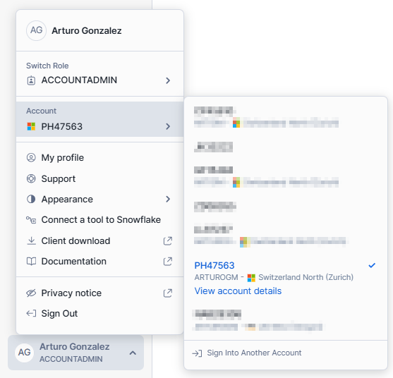
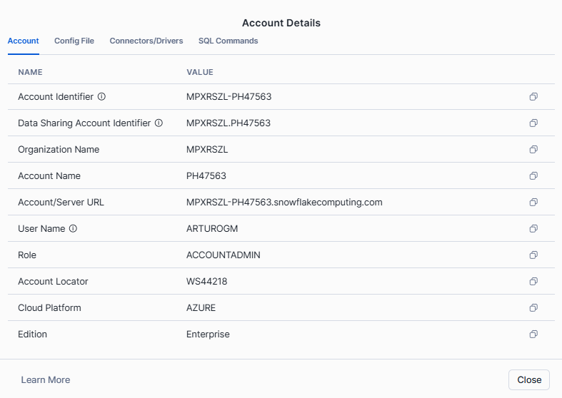

# 🖥️ Exploración de interfaces: SnowSQL  

## Práctica: Interfaz de Línea de Comandos (CLI)  

### 1. Descargar e instalar SnowSQL  
Descarga e instala SnowSQL en tu equipo local desde el siguiente enlace:  
🔗 [Descargar SnowSQL](https://www.snowflake.com/en/developers/downloads/snowsql/)  

---

### 2. Conectar a Snowflake desde la terminal  
Abre la consola de comandos (**Símbolo del sistema**) e introduce el siguiente comando:  

```bash
snowsql -a <account_name> -u <user_name>
```
El nombre de la cuenta lo encontraréis entre 'https://' y 'snowflakecomputing.com'. Por ejemplo de la URL de acceso: 'https://MPXRSZL-PH47563.snowflakecomputing.com/' el account_name sería **MPXRSZL-PH47563**.
```bash
snowsql -a MPXRSZL-PH47563 -u arturogm
```

Después, se solicitará introducir contraseña.

> **Nota:**  
> También se puede encontrar esta información desde el menú inferior izquierdo en Snowsight -> Account -> View account details.




Donde se dispondrá de toda la información necesaria para la conexión de la cuenta de Snowflake con herramientas externas:



---

### 3. Creación de base de datos, esquema y tabla  

Ejecuta los siguientes comandos para crear la base de datos y el esquema en Snowflake:

```sql
CREATE OR REPLACE DATABASE CURSO_SNOWFLAKE_DB;
USE DATABASE CURSO_SNOWFLAKE_DB;
CREATE OR REPLACE SCHEMA CLI_SC;
USE SCHEMA CLI_SC;
```

A continuación, crea una tabla para almacenar información sobre precios de automóviles:  

```sql
CREATE OR REPLACE TABLE CAR_PRICE_DATASET (
    Brand STRING,
    Model STRING,
    Year INT,
    Engine_Size FLOAT,
    Fuel_Type STRING,
    Transmission STRING,
    Mileage INT,
    Doors INT,
    Owner_Count INT,
    Price INT
);
```

Comprobar que la tabla exista aunque esté vacía:
```sql
DESCRIBE TABLE CAR_PRICE_DATASET;
```
---

### 4. Crear el Internal Stage  
Define un **Stage interno** para la carga de datos con formato CSV:  

> **Nota:**  
> Los **Internal Stages** en Snowflake son áreas de almacenamiento temporales que se utilizan para la carga y descarga de datos. Estos stages pueden ser definidos a nivel de cuenta, base de datos o esquema, y permiten almacenar archivos de datos en formatos como CSV, JSON, Avro, Parquet, ORC y XML. Los Internal Stages facilitan la gestión de datos al proporcionar un espacio seguro y eficiente para la transferencia de archivos entre el sistema de archivos local y las tablas de Snowflake.

```sql
CREATE OR REPLACE STAGE car_stage 
FILE_FORMAT = (TYPE = 'CSV' FIELD_OPTIONALLY_ENCLOSED_BY='"' SKIP_HEADER=1);
```

---

### 5. Subir archivo al Internal Stage  
Desde SnowSQL, sube el archivo de datos `car_price_dataset.csv` desde la siguiente ruta:  
🔗 [car_price_dataset.csv](./resources/car_price_dataset.csv)

```bash
PUT 'file://C:/Users/.../docs/resources/car_price_dataset.csv'
@car_stage
AUTO_COMPRESS=TRUE;
```

#### Verificar el archivo en el Internal Stage  
Comprueba que el archivo `car_price_dataset.csv` se ha cargado correctamente en el stage:

```sql
LIST @car_stage;
```

---


### 6. Cargar los datos en la tabla  
Ejecuta el siguiente comando para **importar los datos desde el Stage a la tabla**:  

> **Nota:**  
> El comando `COPY INTO` en Snowflake se utiliza para copiar datos desde un stage (interno o externo) a una tabla en Snowflake. Este comando permite especificar el formato del archivo de origen y otras opciones de carga, facilitando la transferencia de datos de manera eficiente y segura.

```sql
COPY INTO CAR_PRICE_DATASET
FROM @car_stage
FILE_FORMAT = (TYPE = 'CSV' FIELD_OPTIONALLY_ENCLOSED_BY='"' SKIP_HEADER=1);
```

---

### 7. Verificar los datos cargados  
Consulta los primeros 10 registros cargados en la tabla:  

```sql
SELECT * FROM CAR_PRICE_DATASET LIMIT 10;
```

---

## Análisis de datos en Snowflake  

### 8. Contar el número total de registros  
```sql
SELECT COUNT(*) AS total_registros FROM CAR_PRICE_DATASET;
```

### 9.Obtener estadísticas básicas de precios  
```sql
SELECT 
    MIN(Price) AS Precio_Minimo,
    MAX(Price) AS Precio_Maximo,
    AVG(Price) AS Precio_Promedio
FROM CLI_SC.CAR_PRICE_DATASET;
```

#### Consultar la cantidad de autos por marca  
```sql
SELECT Brand, COUNT(*) AS Cantidad
FROM CLI_SC.CAR_PRICE_DATASET
GROUP BY Brand
ORDER BY Cantidad DESC;
```

#### Filtrar autos con más de 100,000 km recorridos  
```sql
SELECT * FROM CLI_SC.CAR_PRICE_DATASET
WHERE Mileage > 100000
ORDER BY Mileage DESC;
```
---

### Cerrar sesión en SnowSQL  
Para finalizar la sesión en SnowSQL, ejecuta el siguiente comando:  

```bash
!exit
```

---

**¡Listo!** Ahora has aprendido a interactuar con Snowflake usando la **Interfaz de Línea de Comandos (CLI)**, desde la conexión hasta la carga y análisis